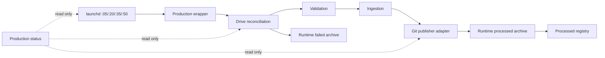

# Production Bridge Architecture

## Scope and invariants

The Production bridge reconciles a durable Google Drive inbox into validated,
environment-separated report and signal artifacts. Its invariants are:

- Production is automatic; Test is manual.
- One reconciliation scans every complete pair currently in the inbox.
- A payload and HTML report must share one event ID and environment.
- Only one Production reconciliation may run at a time.
- A report is published only after validation and ingestion succeed.
- Scheduler health, queue health, and publish evidence are separate claims.
- Synthetic Production events are prohibited as health checks because publishing
  commits and pushes to `main`.

## Module map

| Module | Interface | Implementation hidden behind the interface | Dependency category |
| --- | --- | --- | --- |
| Scheduler | `scripts/run_production_bridge.sh` | settle window, single-instance lock, production-only invocation, logging, exit propagation | local-substitutable shell/process plus external launchd |
| Reconciliation | `scripts/drive_bridge.py --once --environment <environment>` | pair discovery, contract checks, staging, archive, registry, publisher invocation | local-substitutable filesystem plus external Drive File Provider |
| Validation | `validate(payload) -> errors` and `validate_payload.py <path>` | schema, enum, range, and signal checks | in-process |
| Ingestion | `ingest_report.py --payload <path> --html <path>` | event identity, environment paths, history de-duplication, report and metadata writes | local-substitutable filesystem |
| Git publisher adapter | `publish_report.sh --payload <path> --html <path>` | ingest, scoped Git add, commit, and push | true external Git remote and credentials |
| Status | `production_status.py [--json]` | launchd, queue, registry, log, report, and history evidence collection | local-substitutable snapshots plus external launchd/Drive/Git state |
| Deployment | `install-production-bridge.sh --install|--verify` | isolated checkout, launcher/plist installation, rendering, and launchd loading | local filesystem and external launchd |

The Reconciliation module is the deepest operational module: one CLI interface
hides pairing, validation, staging, publishing, archiving, and receipt tracking.
The Git publisher is deliberately an adapter at the true-external Git seam. The
Status module never calls the publisher and is therefore safe for monitoring.

## Data flow

## Queue state model

1. **WAIT** — one member of the payload/report pair is absent; nothing moves.
2. **PAIRED** — both filenames exist and share the derived event ID.
3. **VALIDATED** — schema and environment contract pass.
4. **STAGED** — both files are copied into ignored local runtime state.
5. **PUBLISHED** — report, metadata, and signal history are committed and pushed.
6. **PROCESSED** — staging is archived and the transport receipt is appended.
7. **FAILED** — a staged pair is archived under `runtime/failed`; the Drive pair
   remains durable for diagnosis and retry.

The processed registry is the transport receipt. Production signal history is
the publish idempotency record. They intentionally answer different questions;
the Status module requires both before claiming a verified publish.

## Environment and deployment isolation

The development source repository remains on `/Volumes/VM-Data`. macOS privacy
protections prevent launchd from reading that volume, so Production executes from
`~/.local/share/globalmacro-production` through
`~/.local/bin/globalmacro-production-bridge`. Test continues to run manually from
the development repository.

Code deployment is explicit through the Deployment module. Scheduled
reconciliation does not silently update its own code. This prevents a source edit
from changing Production before the installer and verification gate run.

## Evidence gates

`scripts/production_status.py` reports three independent gates:

- **Scheduler PASS** — canonical minutes, loaded job, at least one run, exit 0,
  clean stdout/stderr, and a complete status-0 log run.
- **Queue PASS** — the configured Production inbox is accessible; counts are
  observed rather than inferred.
- **Publish PASS** — the same Production event ID exists in bridge `[OK]` log,
  processed registry, signal history, report metadata, and its HTML report.

An empty accessible queue is Queue PASS but Publish UNVERIFIED.

## Known limitations

- `pair_timeout_seconds` is reserved configuration; the current implementation
  waits for incomplete pairs without expiring them.
- Registry append is protected by the Production wrapper lock, not by an
  independent cross-entrypoint file transaction.
- A real end-to-end publish cannot be verified until a legitimate Production
  payload/report pair arrives. Scheduler success alone is insufficient.
